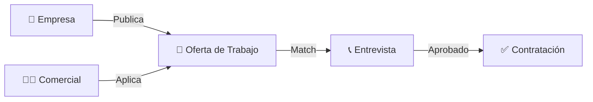

# 🚀 CapitalHub - Marketplace de Talento Comercial

<div align="center">


**Plataforma SaaS B2B que conecta talento comercial de alto nivel con empresas**

[🚀 Inicio Rápido](#-inicio-rápido) • [💻 Desktop Apps](#-desktop-apps) • [✨ Características](#-características) • [🛠 Stack Tecnológico](#-stack-tecnológico) • [📡 API](#-api-endpoints) • [🐳 Docker](#-comandos-docker)

</div>

---

## 🎯 ¿Qué es CapitalHub?

**CapitalHub** es un marketplace innovador que revoluciona la forma en que las empresas encuentran y contratan talento comercial de alto nivel. Conectamos a profesionales de ventas (Setters, Closers, SDRs) con empresas que buscan impulsar su crecimiento.

### 👥 Actores del Sistema

| Actor | Descripción | Funcionalidades |
|-------|-------------|-----------------|
| 🧑‍💼 **Comercial (Rep)** | Profesionales de ventas que buscan oportunidades | Dashboard personal, explorar ofertas, aplicar, seguimiento |
| 🏢 **Empresa (Company)** | Empresas que publican ofertas y contratan talento | Dashboard KPIs, crear ofertas, gestionar candidatos |

### 🔄 Flujo Principal



---

## 🚀 Inicio Rápido

### 📋 Requisitos Previos

- [Docker Desktop](https://www.docker.com/products/docker-desktop/) instalado y en ejecución
- Git instalado
- 4GB RAM mínimo disponible
- Puertos libres: `80`, `3306`, `8081`, `9000`, `9001`

### ⚡ Instalación en 3 Pasos

```bash
# 1️⃣ Clonar el repositorio
git clone https://github.com/SASbot01/Capitalhub.git
cd Capitalhub

# 2️⃣ Levantar con Docker Compose
cd deploy
docker-compose up -d --build

# 3️⃣ Esperar ~2-3 minutos (primera vez)
# Ver progreso: docker-compose logs -f
```

### 🌐 URLs de Acceso

| Servicio | URL | Descripción |
|----------|-----|-------------|
| 🌐 **Frontend** | http://localhost | Aplicación principal |
| 🔧 **Backend API** | http://localhost:8081 | API REST |
| 📦 **MinIO Console** | http://localhost:9001 | Almacenamiento de archivos |
| 🗄️ **MySQL** | localhost:3306 | Base de datos |

---

## 🔐 Credenciales de Prueba

### 🌐 Aplicación Web (http://localhost)

| Rol | Email | Contraseña | Descripción |
|-----|-------|------------|-------------|
| 👤 **Comercial** | `rep@demo.com` | `test123` | Cuenta de prueba para comerciales |
| 🏢 **Empresa** | `demo@company.com` | `test123` | Cuenta de prueba para empresas |
| 🧪 **Test** | `test@test.com` | `test123` | Cuenta genérica de prueba |

### 📦 MinIO Console (http://localhost:9001)

```
Usuario: minioadmin
Contraseña: minioadmin
```

### 🗄️ Base de Datos MySQL

```
Host: localhost:3306
Database: capitalhub
Usuario: root
Contraseña: admin
```

---

## 💻 Desktop Apps

CapitalHub está disponible como **aplicación de escritorio nativa** para Windows, macOS y Linux.

### 📦 Descargar Instaladores

Ve a la página de [**Releases**](https://github.com/SASbot01/capitalhub1.1/releases) y descarga el instalador para tu sistema operativo:

| Sistema Operativo | Archivo | Descripción |
|-------------------|---------|-------------|
| 🪟 **Windows** | `capital-hub_x.x.x_x64_en-US.msi` | Instalador MSI (recomendado) |
| 🪟 **Windows** | `capital-hub_x.x.x_x64-setup.exe` | Instalador NSIS |
| 🍎 **macOS Intel** | `capital-hub_x.x.x_x64.dmg` | Para Macs con procesador Intel |
| 🍎 **macOS Apple Silicon** | `capital-hub_x.x.x_aarch64.dmg` | Para Macs con M1/M2/M3 |
| 🐧 **Linux** | `capital-hub_x.x.x_amd64.AppImage` | AppImage portable |
| 🐧 **Linux** | `capital-hub_x.x.x_amd64.deb` | Paquete Debian/Ubuntu |

### ✨ Características Desktop

- ✅ **Mismo diseño que la web**: Header horizontal, menú responsive
- ✅ **Nativo y rápido**: Construido con Tauri (Rust + WebView)
- ✅ **Ligero**: ~15-20 MB de tamaño
- ✅ **Offline-ready**: Funciona sin conexión (próximamente)
- ✅ **Auto-updates**: Actualizaciones automáticas (próximamente)

### 🚀 Instalación

**Windows:**
1. Descarga el archivo `.msi`
2. Doble click para instalar
3. Sigue el asistente de instalación

**macOS:**
1. Descarga el archivo `.dmg` correspondiente a tu procesador
2. Abre el archivo `.dmg`
3. Arrastra CapitalHub a la carpeta Aplicaciones

**Linux:**
1. Descarga el archivo `.AppImage`
2. Dale permisos de ejecución: `chmod +x capital-hub_*.AppImage`
3. Ejecuta: `./capital-hub_*.AppImage`

### 🔄 Releases Automáticos

Los instaladores se generan **automáticamente** con GitHub Actions para cada versión. Ver [`.github/README.md`](.github/README.md) para más detalles.

---

## ✨ Características

### 🧑‍💼 Panel de Comerciales (Rep)

- ✅ **Autenticación Segura**: Login/Registro con JWT
- 📊 **Dashboard Personal**: Métricas de actividad semanal
  - Aplicaciones enviadas
  - Entrevistas programadas
  - Ofertas recibidas
  - Rechazos
- 🔍 **Explorador de Ofertas**: Búsqueda y filtrado de trabajos
- 📝 **Aplicaciones**: Sistema de aplicación con un clic
- 📈 **Seguimiento**: Estado de aplicaciones en tiempo real
- 👤 **Perfil Profesional**: Edición completa de datos
- 🎓 **Formación**: Acceso a módulos de capacitación
- ⭐ **Reseñas**: Sistema de valoraciones
- 🔔 **Notificaciones**: Alertas por email

### 🏢 Panel de Empresas (Company)

- ✅ **Autenticación Segura**: Login/Registro con JWT
- 📊 **Dashboard KPIs**: Métricas de contratación
  - Ofertas activas
  - Total de aplicaciones
  - Candidatos en proceso
  - Contrataciones realizadas
- 💼 **Gestión de Ofertas**: CRUD completo de ofertas de trabajo
- 👥 **Gestión de Candidatos**: 
  - Visualización de aplicaciones
  - Filtrado por estado
  - Acciones: Entrevistar, Contratar, Descartar
- 🏢 **Perfil de Empresa**: Edición de información corporativa
- 📧 **Sistema de Emails**: Notificaciones automáticas
- ⚙️ **Configuración**: Gestión de cuenta

### 🔒 Seguridad y Autenticación

- 🔐 **JWT Authentication**: Tokens seguros con expiración
- 🛡️ **Spring Security**: Protección de endpoints
- 🔑 **Recuperación de Contraseña**: Sistema de reset por email
- 🚪 **Rutas Protegidas**: Control de acceso por roles
- 🔄 **Refresh Tokens**: Sesiones persistentes

### 📧 Sistema de Emails

- ✉️ **Bienvenida**: Email automático al registrarse
- 🔑 **Reset de Contraseña**: Enlaces seguros de recuperación
- 📬 **Notificaciones**: Alertas de aplicaciones y cambios de estado
- 🎖️ **Badges**: Sistema de insignias y logros

---

## 🛠 Stack Tecnológico

### 🔙 Backend

| Tecnología | Versión | Uso |
|------------|---------|-----|
| **Java** | 21 | Lenguaje principal |
| **Spring Boot** | 3.2.2 | Framework backend |
| **Spring Security** | 6.x | Autenticación JWT |
| **Spring Data JPA** | - | ORM y persistencia |
| **Hibernate** | - | Implementación JPA |
| **Flyway** | Latest | Migraciones de BD |
| **MySQL** | 8.0 | Base de datos |
| **MinIO** | Latest | Almacenamiento S3 |
| **JavaMailSender** | - | Envío de emails |
| **Lombok** | Latest | Reducción de boilerplate |
| **Maven** | - | Gestión de dependencias |

### 🎨 Frontend

| Tecnología | Versión | Uso |
|------------|---------|-----|
| **React** | 19.2.0 | Framework UI |
| **TypeScript** | 5.9.3 | Tipado estático |
| **Vite** | 7.2.2 | Build tool |
| **React Router** | 7.9.6 | Navegación SPA |
| **Tailwind CSS** | 3.4.18 | Estilos utility-first |
| **Lucide React** | 0.554.0 | Iconografía |
| **Capacitor** | 8.0.0 | Soporte móvil |
| **Tauri** | 2.9.6 | Aplicación desktop |

### 🐳 Infraestructura

| Tecnología | Uso |
|------------|-----|
| **Docker** | Contenedorización |
| **Docker Compose** | Orquestación multi-contenedor |
| **Nginx** | Servidor web y proxy reverso |
| **Cloudflare Tunnel** | Acceso seguro externo |

---

## 📁 Estructura del Proyecto

```
capitalhub/
├── 📂 backend/                           # API Spring Boot
│   ├── 📂 src/main/java/com/capitalhub/
│   │   ├── 📂 applications/              # Gestión de aplicaciones a ofertas
│   │   ├── 📂 auth/                      # Autenticación y autorización JWT
│   │   │   ├── controller/               # Login, Signup, Password Reset
│   │   │   ├── service/                  # EmailService, PasswordResetService
│   │   │   └── entity/                   # User, PasswordResetToken
│   │   ├── 📂 company/                   # Módulo de empresas
│   │   │   ├── controller/               # CompanyController
│   │   │   ├── service/                  # CompanyService
│   │   │   └── entity/                   # CompanyProfile
│   │   ├── 📂 config/                    # Configuraciones
│   │   │   ├── SecurityConfig.java       # Spring Security + JWT
│   │   │   ├── CorsConfig.java           # CORS
│   │   │   └── MinioConfig.java          # MinIO S3
│   │   ├── 📂 dashboard/                 # Estadísticas y KPIs
│   │   ├── 📂 jobs/                      # Ofertas de trabajo
│   │   │   ├── controller/               # JobOfferController
│   │   │   ├── service/                  # JobOfferService
│   │   │   └── entity/                   # JobOffer
│   │   ├── 📂 media/                     # Subida de archivos (MinIO)
│   │   ├── 📂 rep/                       # Módulo de comerciales
│   │   │   ├── controller/               # RepController
│   │   │   ├── service/                  # RepService
│   │   │   └── entity/                   # RepProfile
│   │   ├── 📂 reviews/                   # Sistema de reseñas
│   │   └── 📂 training/                  # Módulos de formación
│   ├── 📂 src/main/resources/
│   │   ├── application.yml               # Configuración Spring
│   │   └── 📂 db/migration/              # Scripts SQL Flyway
│   │       ├── V1__Initial_Schema.sql
│   │       ├── V2__Add_Companies.sql
│   │       └── V11__Add_Weekly_Activity.sql
│   └── pom.xml                           # Dependencias Maven
│
├── 📂 frontend/                          # Aplicación React
│   ├── 📂 src/
│   │   ├── 📂 api/                       # Cliente HTTP (Axios)
│   │   │   └── api.ts                    # Configuración base API
│   │   ├── 📂 components/                # Componentes reutilizables
│   │   │   ├── Navbar.tsx
│   │   │   ├── Footer.tsx
│   │   │   └── JobCard.tsx
│   │   ├── 📂 context/                   # Context API
│   │   │   └── AuthContext.tsx           # Estado de autenticación
│   │   ├── 📂 hooks/                     # Custom hooks
│   │   │   └── useFetch.ts
│   │   ├── 📂 layouts/                   # Layouts de página
│   │   │   ├── MainLayout.tsx
│   │   │   └── DashboardLayout.tsx
│   │   ├── 📂 pages/                     # Páginas de la aplicación
│   │   │   ├── 📂 auth/                  # Login, Signup, ForgotPassword
│   │   │   ├── 📂 rep/                   # Dashboard, Jobs, Applications
│   │   │   ├── 📂 company/               # Dashboard, CreateJob, Candidates
│   │   │   └── HomePage.tsx
│   │   ├── App.tsx                       # Componente raíz
│   │   ├── routes.tsx                    # Configuración de rutas
│   │   └── main.tsx                      # Entry point
│   ├── package.json                      # Dependencias npm
│   ├── tsconfig.json                     # Configuración TypeScript
│   ├── vite.config.ts                    # Configuración Vite
│   └── tailwind.config.js                # Configuración Tailwind
│
├── 📂 deploy/                            # Configuración Docker
│   ├── docker-compose.yml                # Orquestación de servicios
│   ├── Dockerfile.backend                # Imagen backend
│   ├── Dockerfile.frontend               # Imagen frontend
│   └── nginx.conf                        # Configuración Nginx
│
├── 📂 docs/                              # Documentación adicional
│
├── .gitignore                            # Archivos ignorados por Git
└── README.md                             # Este archivo
```

---

## 📡 API Endpoints

### 🔐 Autenticación (`/api/auth`)

| Método | Endpoint | Descripción | Body |
|--------|----------|-------------|------|
| `POST` | `/auth/login` | Iniciar sesión | `{ email, password }` |
| `POST` | `/auth/signup/rep` | Registro comercial | `{ email, password, fullName, phone }` |
| `POST` | `/auth/signup/company` | Registro empresa | `{ email, password, companyName, industry }` |
| `POST` | `/auth/forgot-password` | Solicitar reset | `{ email }` |
| `POST` | `/auth/reset-password` | Cambiar contraseña | `{ token, newPassword }` |

**Respuesta Login/Signup:**
```json
{
  "token": "eyJhbGciOiJIUzI1NiIsInR5cCI6IkpXVCJ9...",
  "role": "REP" | "COMPANY",
  "email": "user@example.com"
}
```

### 🧑‍💼 Comerciales (`/api/rep`)

| Método | Endpoint | Descripción | Auth |
|--------|----------|-------------|------|
| `GET` | `/rep/me` | Obtener mi perfil | ✅ |
| `PUT` | `/rep/me` | Actualizar perfil | ✅ |
| `GET` | `/rep/dashboard/stats` | Estadísticas personales | ✅ |
| `GET` | `/rep/jobs` | Listar ofertas disponibles | ✅ |
| `GET` | `/rep/jobs/{id}` | Detalle de oferta | ✅ |
| `POST` | `/rep/jobs/{id}/apply` | Aplicar a oferta | ✅ |
| `GET` | `/rep/applications` | Mis aplicaciones | ✅ |

**Ejemplo Response `/rep/dashboard/stats`:**
```json
{
  "applicationsThisWeek": 5,
  "interviewsThisWeek": 2,
  "offersThisWeek": 1,
  "rejectionsThisWeek": 1
}
```

### 🏢 Empresas (`/api/company`)

| Método | Endpoint | Descripción | Auth |
|--------|----------|-------------|------|
| `GET` | `/company/me` | Obtener mi perfil | ✅ |
| `PUT` | `/company/me` | Actualizar perfil | ✅ |
| `GET` | `/company/dashboard/stats` | KPIs de contratación | ✅ |
| `GET` | `/company/jobs` | Mis ofertas publicadas | ✅ |
| `POST` | `/company/jobs` | Crear nueva oferta | ✅ |
| `GET` | `/company/jobs/{id}` | Detalle de oferta | ✅ |
| `PUT` | `/company/jobs/{id}` | Actualizar oferta | ✅ |
| `PATCH` | `/company/jobs/{id}/status` | Cambiar estado (ACTIVE/CLOSED) | ✅ |
| `DELETE` | `/company/jobs/{id}` | Eliminar oferta | ✅ |
| `GET` | `/company/applications` | Todas las aplicaciones | ✅ |
| `GET` | `/company/applications/{jobId}` | Aplicaciones por oferta | ✅ |
| `PATCH` | `/company/applications/{id}/status` | Gestionar candidato | ✅ |

**Estados de Aplicación:**
- `PENDING` - Pendiente de revisión
- `INTERVIEW` - En proceso de entrevista
- `HIRED` - Contratado
- `REJECTED` - Rechazado

**Ejemplo Request `POST /company/jobs`:**
```json
{
  "title": "Closer B2B - SaaS",
  "description": "Buscamos closer con experiencia en ventas B2B...",
  "location": "Remoto",
  "salaryMin": 30000,
  "salaryMax": 50000,
  "employmentType": "FULL_TIME",
  "requirements": "2+ años de experiencia en ventas B2B"
}
```

### 📁 Media (`/api/media`)

| Método | Endpoint | Descripción | Auth |
|--------|----------|-------------|------|
| `POST` | `/media/upload` | Subir archivo a MinIO | ✅ |
| `GET` | `/media/{filename}` | Obtener URL de archivo | ✅ |

---

## 💻 Desarrollo Local (Sin Docker)

### 🔙 Backend

```bash
# Requisitos: Java 21, Maven, MySQL corriendo en localhost:3306

cd backend

# Crear base de datos
mysql -u root -p
CREATE DATABASE capitalhub;
exit;

# Configurar application.yml con tus credenciales locales

# Ejecutar
mvn clean install
mvn spring-boot:run

# Disponible en http://localhost:8081
```

### 🎨 Frontend

```bash
cd frontend

# Configurar variable de entorno
echo "VITE_API_BASE_URL=http://localhost:8081" > .env

# Instalar dependencias
npm install

# Ejecutar en desarrollo
npm run dev

# Disponible en http://localhost:5173
```

### 🏗️ Build de Producción

```bash
# Backend
cd backend
mvn clean package
java -jar target/backend-0.0.1-SNAPSHOT.jar

# Frontend
cd frontend
npm run build
# Archivos en dist/
```

---

## 🐳 Comandos Docker

### 🚀 Gestión de Servicios

```bash
cd deploy

# Levantar todos los servicios
docker-compose up -d

# Levantar con rebuild
docker-compose up -d --build

# Ver estado de servicios
docker-compose ps

# Parar todos los servicios
docker-compose down

# Parar y eliminar volúmenes (¡BORRA DATOS!)
docker-compose down -v
```

### 📋 Logs y Debugging

```bash
# Ver logs de todos los servicios
docker-compose logs -f

# Ver logs de un servicio específico
docker-compose logs -f backend
docker-compose logs -f frontend
docker-compose logs -f mysql

# Ver últimas 100 líneas
docker-compose logs --tail=100 backend
```

### 🔄 Reiniciar Servicios

```bash
# Reiniciar un servicio
docker-compose restart backend

# Reconstruir sin caché
docker-compose build --no-cache backend
docker-compose up -d backend

# Reconstruir todo
docker-compose down
docker-compose build --no-cache
docker-compose up -d
```

### 🧹 Limpieza

```bash
# Limpiar contenedores parados
docker container prune

# Limpiar imágenes no usadas
docker image prune -a

# Limpiar volúmenes no usados
docker volume prune

# Limpieza completa del sistema
docker system prune -a --volumes
```

### 🔍 Inspección

```bash
# Entrar al contenedor backend
docker exec -it capitalhub-backend bash

# Entrar a MySQL
docker exec -it capitalhub-mysql mysql -uroot -padmin capitalhub

# Ver uso de recursos
docker stats

# Inspeccionar red
docker network inspect deploy_capitalhub-network
```

---

## 🌐 Despliegue en Producción

### ☁️ Cloudflare Tunnel

El proyecto incluye configuración de Cloudflare Tunnel para acceso externo seguro:

```yaml
# En docker-compose.yml
tunnel:
  image: cloudflare/cloudflared:latest
  environment:
    - TUNNEL_TOKEN=tu_token_aqui
```

**Configurar Cloudflare Tunnel:**

1. Crear cuenta en [Cloudflare](https://dash.cloudflare.com/)
2. Ir a Zero Trust > Access > Tunnels
3. Crear nuevo tunnel
4. Copiar token y agregarlo a `docker-compose.yml`
5. Configurar rutas públicas hacia `frontend:80`

### 📧 Configuración de Email

Actualizar en `docker-compose.yml`:

```yaml
environment:
  MAIL_HOST: smtp.ionos.es
  MAIL_PORT: 587
  MAIL_USERNAME: info@capitalhub.es
  MAIL_PASSWORD: "TU_CONTRASEÑA_AQUI"
```

Proveedores soportados:
- IONOS
- Gmail (requiere App Password)
- SendGrid
- Mailgun
- Amazon SES

### 🔒 Variables de Entorno de Producción

```bash
# Backend
JWT_SECRET=genera_un_secret_seguro_de_64_caracteres
JWT_EXPIRATION=86400000  # 24 horas

# Base de datos
MYSQL_ROOT_PASSWORD=contraseña_segura
MYSQL_DATABASE=capitalhub
MYSQL_PASSWORD=contraseña_segura

# MinIO
MINIO_ROOT_USER=admin_seguro
MINIO_ROOT_PASSWORD=contraseña_muy_segura

# Frontend
FRONTEND_URL=https://tudominio.com
```

---

## 🧪 Testing

### Backend Tests

```bash
cd backend
mvn test
```

### Frontend Tests

```bash
cd frontend
npm run test
```

---

## 🐛 Troubleshooting

### ❌ Error: Puerto 80 ya en uso

```bash
# Windows
netstat -ano | findstr :80
taskkill /PID <PID> /F

# Linux/Mac
sudo lsof -i :80
sudo kill -9 <PID>
```

### ❌ Error: MySQL no inicia

```bash
# Ver logs
docker-compose logs mysql

# Eliminar volumen y reiniciar
docker-compose down -v
docker-compose up -d
```

### ❌ Error: Backend no conecta a MySQL

```bash
# Verificar que MySQL esté healthy
docker-compose ps

# Esperar a que MySQL termine de iniciar
docker-compose logs -f mysql
# Buscar: "ready for connections"
```

### ❌ Error: Frontend muestra página en blanco

```bash
# Verificar logs de Nginx
docker-compose logs frontend

# Reconstruir frontend
docker-compose build --no-cache frontend
docker-compose up -d frontend
```

---

## 📚 Recursos Adicionales

### 📖 Documentación

- [Spring Boot Docs](https://spring.io/projects/spring-boot)
- [React Docs](https://react.dev/)
- [Docker Docs](https://docs.docker.com/)
- [Tailwind CSS](https://tailwindcss.com/)

### 🎓 Tutoriales

- [JWT Authentication con Spring Security](https://www.baeldung.com/spring-security-oauth-jwt)
- [React Router v6](https://reactrouter.com/)
- [Docker Compose](https://docs.docker.com/compose/)

---

## 🤝 Contribución

Este es un proyecto privado. Para contribuir:

1. Fork el repositorio
2. Crea una rama feature (`git checkout -b feature/AmazingFeature`)
3. Commit tus cambios (`git commit -m 'Add some AmazingFeature'`)
4. Push a la rama (`git push origin feature/AmazingFeature`)
5. Abre un Pull Request

---

## 📝 Changelog

### v1.0.0 (2025-01-23)

- ✅ Sistema de autenticación JWT completo
- ✅ Módulo de comerciales (Rep) con dashboard
- ✅ Módulo de empresas (Company) con gestión de ofertas
- ✅ Sistema de aplicaciones y seguimiento
- ✅ Integración con MinIO para almacenamiento
- ✅ Sistema de emails con JavaMailSender
- ✅ Recuperación de contraseña
- ✅ Dashboard con métricas en tiempo real
- ✅ Despliegue con Docker Compose
- ✅ Cloudflare Tunnel para acceso externo
- ✅ Migraciones de base de datos con Flyway

---

## 📄 Licencia

Proyecto privado - Todos los derechos reservados © 2025 CapitalHub

---

## 👨‍💻 Autor

**SASbot01**
- GitHub: [@SASbot01](https://github.com/SASbot01)
- Email: silvestrefuentesalejandro@gmail.com

---

<div align="center">

### 🚀 CapitalHub - Conectando Talento con Oportunidades

**Desarrollado con ❤️ usando Spring Boot, React y Docker**


[⬆ Volver arriba](#-capitalhub---marketplace-de-talento-comercial)

</div>
